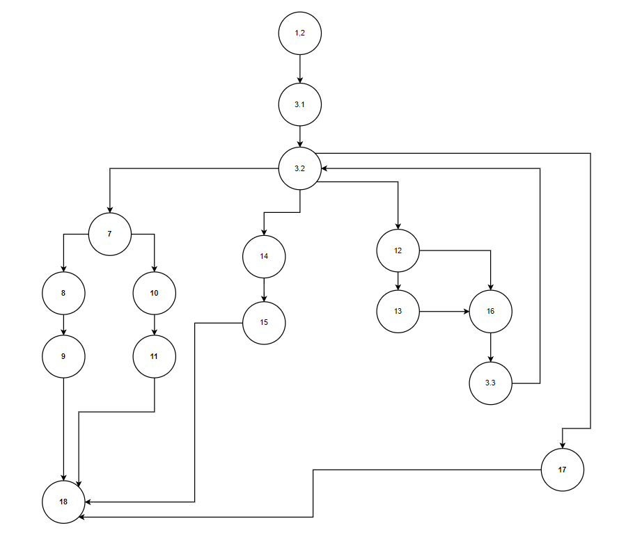
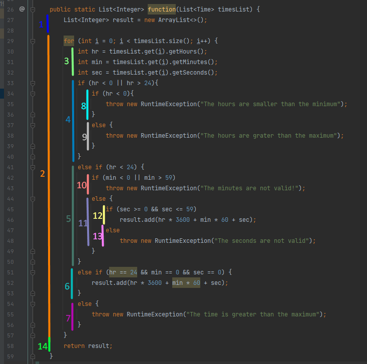

<h1>Втора лабараториска вежба по софтверско инжинерство</h>

<h2>Борче Смилески, број на индекс 193085</h2>

<h2>Control Flow Graph</h2>

<h2>Цикломатска комплексност</h2>
Цикломатска комплексност на овој код е 5 бидејќи толку изнесува бројот на региони.
<h2>Тест случаи според критериумот Every Branch</h2>
<pre><code>
class EveryBranch {
    //1,2,3,4,8
    @Test
    public void test1() {
        Time t = new Time(-11, 30, 30);
        List<Time> lists = new ArrayList<>();
        lists.add(t);
        try {
            SILab2.function(lists);
        } catch (Exception e) {
            assertEquals(e.getMessage(), "The hours are smaller than the minimum");
        }
    }
    //1,2,3,4,9
    @Test
    public void test2() {
        //Testing branch 1,2,3,4,5,8
        Time t = new Time(34, 30, 30);
        List<Time> lists = new ArrayList<>();
        lists.add(t);
        try {
            SILab2.function(lists);
        } catch (Exception e) {
            assertEquals(e.getMessage(), "The hours are grater than the maximum");
        }
    }
    //1,2,3,5,10
    @Test
    public void test3() {
        //Testing branch 1,2,3,4,5,8
        Time t = new Time(14, 74, 30);
        List<Time> lists = new ArrayList<>();
        lists.add(t);
        try {
            SILab2.function(lists);
        } catch (Exception e) {
            assertEquals(e.getMessage(), "The minutes are not valid!");
        }
    }
    //1,2,3,5,11,12
    @Test
    public void test4() {
        Time t = new Time(15, 26, 52);
        List<Time> list = new ArrayList<>();
        List<Integer> result = new ArrayList<>();
        list.add(t);
        result = SILab2.function(list);
        assertEquals(result.get(0).intValue(), t.getHours() * 3600 + t.getMinutes() * 60 + t.getSeconds());
    }
    //1,2,3,5,11,13
    @Test
    public void test5() {
        //Testing branch 1,2,3,4,5,8
        Time t = new Time(14, 54, 70);
        List<Time> lists = new ArrayList<>();
        lists.add(t);
        try {
            SILab2.function(lists);
        } catch (Exception e) {
            assertEquals(e.getMessage(), "The seconds are not valid");
        }
    }
    //1,2,3,6
    @Test
    public void test6() {
        Time t = new Time(24, 0, 0);
        List<Time> list = new ArrayList<>();
        List<Integer> result = new ArrayList<>();
        list.add(t);
        result = SILab2.function(list);
        assertEquals(result.get(0).intValue(), t.getHours() * 3600 + t.getMinutes() * 60 + t.getSeconds());
    }
    //1,2,3,7
    @Test
    public void test7() {
        Time t = new Time(24, 0, 2);
        List<Time> lists = new ArrayList<>();
        lists.add(t);
        try {
            SILab2.function(lists);
        } catch (Exception e) {
            assertEquals(e.getMessage(), "The time is greater than the maximum");
        }
    }
}
</code></pre>
<h2>Тест случаи според критериумот Multiple condition</h2>
<pre><code>
class MultipleCondition {
    //1,2,3,4,8
    @Test
    public void test1() {
        Time t = new Time(-11, 30, 30);
        List<Time> lists = new ArrayList<>();
        lists.add(t);
        try {
            SILab2.function(lists);
        } catch (Exception e) {
            assertEquals(e.getMessage(), "The hours are smaller than the minimum");
        }
    }
    //1,2,3,4,9
    @Test
    public void test2() {
        Time t = new Time(56, 30, 30);
        List<Time> lists = new ArrayList<>();
        lists.add(t);
        try {
            SILab2.function(lists);
        } catch (Exception e) {
            assertEquals(e.getMessage(), "The hours are grater than the maximum");
        }
    }
    //1,2,3,6
    @Test
    public void test3() {
        Time t = new Time(14, 0, 0);
        List<Time> list = new ArrayList<>();
        List<Integer> result = new ArrayList<>();
        list.add(t);
        result = SILab2.function(list);
        assertEquals(result.get(0).intValue(), t.getHours() * 3600 + t.getMinutes() * 60 + t.getSeconds());
    }
    //1,2,3,5,10 F || X
    @Test
    public void test4() {
        Time t = new Time(14, -23, 30);
        List<Time> lists = new ArrayList<>();
        lists.add(t);
        try {
            SILab2.function(lists);
        } catch (Exception e) {
            assertEquals(e.getMessage(), "The minutes are not valid!");
        }
    }
    //1,2,3,5,10 X || F
    @Test
    public void test5() {
        Time t = new Time(14, 73, 30);
        List<Time> lists = new ArrayList<>();
        lists.add(t);
        try {
            SILab2.function(lists);
        } catch (Exception e) {
            assertEquals(e.getMessage(), "The minutes are not valid!");
        }
    }
    //1,2,3,5,11,12 F || F
    @Test
    public void test6() {
        Time t = new Time(15, 26, 52);
        List<Time> list = new ArrayList<>();
        List<Integer> result = new ArrayList<>();
        list.add(t);
        result = SILab2.function(list);
        assertEquals(result.get(0).intValue(), t.getHours() * 3600 + t.getMinutes() * 60 + t.getSeconds());
    }
    //1,2,3,5,11,12 T && T
    @Test
    public void test7() {
        Time t = new Time(15, 26, 52);
        List<Time> list = new ArrayList<>();
        List<Integer> result = new ArrayList<>();
        list.add(t);
        result = SILab2.function(list);
        assertEquals(result.get(0).intValue(), t.getHours() * 3600 + t.getMinutes() * 60 + t.getSeconds());
    }
    //1,2,3,5,11,13 F && T
    @Test
    public void test8() {
        //Testing branch 1,2,3,4,5,8
        Time t = new Time(14, 54, -40);
        List<Time> lists = new ArrayList<>();
        lists.add(t);
        try {
            SILab2.function(lists);
        } catch (Exception e) {
            assertEquals(e.getMessage(), "The seconds are not valid");
        }
    }
    //1,2,3,5,11,13 T && F
    @Test
    public void test9() {
        //Testing branch 1,2,3,4,5,8
        Time t = new Time(14, 54, 90);
        List<Time> lists = new ArrayList<>();
        lists.add(t);
        try {
            SILab2.function(lists);
        } catch (Exception e) {
            assertEquals(e.getMessage(), "The seconds are not valid");
        }
    }
    //1,2,3,6 T && T && T
    @Test
    public void test10() {
        Time t = new Time(24, 0, 0);
        List<Time> list = new ArrayList<>();
        List<Integer> result = new ArrayList<>();
        list.add(t);
        result = SILab2.function(list);
        assertEquals(result.get(0).intValue(), t.getHours() * 3600 + t.getMinutes() * 60 + t.getSeconds());
    }
    //1,2,3,4,8  F && T && T
    @Test
    public void test11() {
        Time t = new Time(-11, 0, 0);
        List<Time> lists = new ArrayList<>();
        lists.add(t);
        try {
            SILab2.function(lists);
        } catch (Exception e) {
            assertEquals(e.getMessage(), "The hours are smaller than the minimum");
        }
    }
    //1,2,3,7  T && F && T
    @Test
    public void test12() {
        Time t = new Time(24, 5, 0);
        List<Time> lists = new ArrayList<>();
        lists.add(t);
        try {
            SILab2.function(lists);
        } catch (Exception e) {
            assertEquals(e.getMessage(), "The time is greater than the maximum");
        }
    }
    //1,2,3,7  T && T && F
    @Test
    public void test13() {
        Time t = new Time(24, 0, 42);
        List<Time> lists = new ArrayList<>();
        lists.add(t);
        try {
            SILab2.function(lists);
        } catch (Exception e) {
            assertEquals(e.getMessage(), "The time is greater than the maximum");
        }
    }
}
</code></pre>

<h1>Објаснување на напишаните unit tests : Every Branch</h1>

Тест случаеви каде тестираме да влезиме во сите гранки од кодот

Тест 1: 
Во овој тест случај ги тестираме чекорите 1,2,3,4,8, во кој влагаме во првиот услов (hr < 0 || hr > 24) да не е во тој опсег, па после тоа часовите да се помали од 0 за да го даде првиот исклучок,("The hours are smaller than the minimum").

 

Тест 2: 
Во овој тест случај ги тестираме чекорите 1,2,3,4,8, во кој влагаме во првиот услов (hr < 0 || hr > 24) да не е во тој опсег, па после тоа часовите да се поголеми ли од 24 за да го даде вториот исклучок,("The hours are grater than the maximum".

 

Тест 3: 
Во овој тест случај ги тестираме чекорите 1,2,3,4,5,8 во кој влагаме во вториот услов (hr < 24) да е во тој опсег, па после тоа ако минутите се помали од 0 или поголеми од 59 да даде исклучок ("The minutes are not valid!").

 

Тест 4: 
Во овој тест случај ги тестираме чекорите 1,2,3,5,11,12 во кој влагаме во вториот услов (hr < 24) да е во тој опсег, па после тоа ако минутите се во ред и секундите се во опсег (sec >= 0 && sec <= 59) да провериме дали ќе даде точен резултат.

 

Тест 5: 
Во овој тест случај ги тестираме чекорите 1,2,3,5,11,13 во кој влагаме во вториот услов (hr < 24) да е во тој опсег, па после тоа ако минутите се во ред а секундите не се во опсег (sec >= 0 && sec <= 59) да даде исклучок ("The seconds are not valid").

 

Тест 6: 
Во овој тест случај ги тестираме чекорите 1,2,3,6 во кој влагаме во третиот услов (hr == 24 && min == 0 && sec == 0) и ако е сите аргументи го исполнуваат овој услов да го провериме резултатот.

 

Тест 7: 
Во овој тест случај ги тестираме чекорите 1,2,3,7 во кој услов ни е часовите да изнесуваат 24 а минутите или секундите да се различни од нула за да го даде исклучокот ("The time is greater than the maximum").

 

<h1>Објаснување на напишаните unit tests : Multiple condition</h1>

Тест случаеви каде ги тестираме сите можни услови од типот и / или (||)(&&)

Тест 1: 
Во овој тест случај ги тестираме чекорите 1,2,3,4,8 во кој влагаме во првиот услов (hr < 0 || hr > 24) да не е во тој опсег, па после тоа F || X тоа барем едниот првиот аргумент да не е точен со што ќе го добиеме исклучокот ("The hours are lower than the minimum").

 

Тест 2: 
Во овој тест случај ги тестираме чекорите 1,2,3,4,9 во кој влагаме во првиот услов (hr < 0 || hr > 24) да не е во тој опсег, па после тоа x || F вториот аргумент да не е точен со што ќе го добиеме исклучокот ("The hours are grater than the maximum")

 

Тест 3: 
Во овој тест случај ги тестираме чекорите 1,2,3,6 каде не влагаме во првиот услов (hr < 0 || hr > 24) бидејќи двата услови ќе бидат задоволени и ќе влезиме во 6-от чекор каде што ќе се тестира резултатот.

 

Тест 4: 
Во овој тест случај ги тестираме чекорите 1,2,3,5,10 каде доаѓаме до условот (min < 0 || min > 59) каде F || X односно минутите ќе се помали и ќе даде исклучок ("The minutes are not valid!")

 

Тест 5: 
Во овој тест случај ги тестираме чекорите 1,2,3,5,10 каде доаѓаме до условот (min < 0 || min > 59) каде X || F односно минутите ќе се поголеми и ќе даде исклучок ("The minutes are not valid!")

 

Тест 6: 
Во овој тест случај ги тестираме чекорите 1,2,3,5,11,12 каде доаѓаме до условот (min < 0 || min > 59) каде Т || Т односно минутите ќе се во точен опсег и ќе дојдеме до решение каде се проверува точно решение.

 

Тест 7: 
Во овој тест случај ги тестираме чекорите 1,2,3,5,11,12 каде доаѓаме до условот (sec >= 0 && sec <= 59) за да се исполни условот секудните треба да се во опсег од 0 до 59, па затоа се проверува со точно решение.

 

Тест 8: 
Во овој тест случај ги тестираме чекорите 1,2,3,5,11,13 каде доаѓаме до условот (sec >= 0 && sec <= 59) F && X каде секудните се помали од 0 и затоа доаѓа до исклучок ("The seconds are not valid").

 

Тест 9: 
Во овој тест случај ги тестираме чекорите 1,2,3,5,11,13 каде доаѓаме до условот (sec >= 0 && sec <= 59) X && F каде секудните се поголеми од 59 и затоа доаѓа до исклучок ("The seconds are not valid").

 

Тест 10: 
Во овој тест случај ги тестираме чекорите 1,2,3,4,8 каде доаѓаме до условот (hr == 24 && min == 0 && sec == 0) за да се исполни условот сите го задоволуваат барањето и се тестира со точно решение.

 
Тест 11: 
Во овој тест случај ги тестираме чекорите 1,2,3,4,8 каде доаѓаме до условот (hr == 24 && min == 0 && sec == 0) F && X && X ќе дојде до исклучок ("The time is greater than the maximum")

 

 
Тест 12: 
Во овој тест случај ги тестираме чекорите 1,2,3,7 каде доаѓаме до условот (hr == 24 && min == 0 && sec == 0) T && F && T ќе дојде до исклучок ("The time is greater than the maximum")

 

 
Тест 12: 
Во овој тест случај ги тестираме чекорите 1,2,3,7 каде доаѓаме до условот (hr == 24 && min == 0 && sec == 0) T && T && F ќе дојде до исклучок ("The time is greater than the maximum")

 